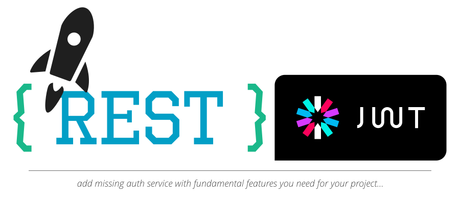

# commons-auth

Add the missing auth service to your spring-boot applications. We [@rocketbase.io](https://www.rocketbase.io) develop many microservices and tried many tools and projects. All of them didn't matched our needs or were too enterprise for smaller projects .

The implementation bases on spring-boot: mainly on **spring-mvc**, **spring-data**, **javax.mail** and **jjwt**

**Features:**
* many is planned :)

## commons-auth-api

This module provides the DTOs and a client to communicate with the authentication endpoints.

## commons-auth-core

Containing an implementation for Token-Generators, UserManagement, Filters and many more...

## commons-auth-mongo

Containing the persistence layer for user via mongo-db

## commons-auth-sample

Sample spring-boot application to demonstrate the use of the provided commons-auth libraries. 

### The MIT License (MIT)
Copyright (c) 2018 rocketbase.io

Permission is hereby granted, free of charge, to any person obtaining a copy of this software and associated documentation files (the "Software"), to deal in the Software without restriction, including without limitation the rights to use, copy, modify, merge, publish, distribute, sublicense, and/or sell copies of the Software, and to permit persons to whom the Software is furnished to do so, subject to the following conditions:

The above copyright notice and this permission notice shall be included in all copies or substantial portions of the Software.

THE SOFTWARE IS PROVIDED "AS IS", WITHOUT WARRANTY OF ANY KIND, EXPRESS OR IMPLIED, INCLUDING BUT NOT LIMITED TO THE WARRANTIES OF MERCHANTABILITY, FITNESS FOR A PARTICULAR PURPOSE AND NONINFRINGEMENT. IN NO EVENT SHALL THE AUTHORS OR COPYRIGHT HOLDERS BE LIABLE FOR ANY CLAIM, DAMAGES OR OTHER LIABILITY, WHETHER IN AN ACTION OF CONTRACT, TORT OR OTHERWISE, ARISING FROM, OUT OF OR IN CONNECTION WITH THE SOFTWARE OR THE USE OR OTHER DEALINGS IN THE SOFTWARE.